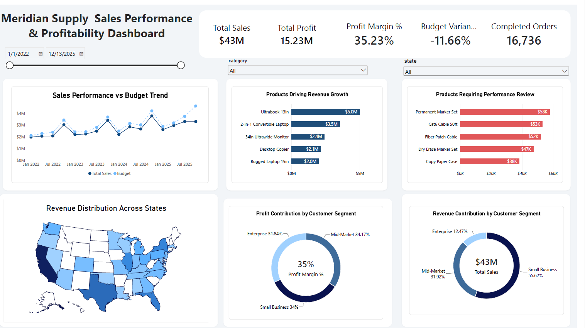

<h1 align="center">
  <br>
  📊 Meridian Office & Tech Supply Co.
  <br>
  <sub>Order-to-Cash Analytics Platform · 2022 – 2025</sub>
  <br>
</h1>

<p align="center">
  
  
  
  
  
</p>

<p align="center">
  <b>An end-to-end analytics pipeline</b> that turns a raw multi-sheet Excel workbook
  into a governed star schema, a live Power BI semantic model, and an executive
  dashboard suite — fully reproducible from a single command.
</p>

---

## 🧭 Table of Contents

- [Overview](#-overview)
- [Headline Results](#-headline-results)
- [Dashboard Preview](#-dashboard-preview)
- [Architecture](#-architecture)
- [Project Structure](#-project-structure)
- [Getting Started](#-getting-started)
- [The Pipeline, Step by Step](#-the-pipeline-step-by-step)
- [Data Model](#-data-model)
- [Power BI Layer](#-power-bi-layer)
- [DAX Measure Library](#-dax-measure-library)
- [Validation & Quality Gates](#-validation--quality-gates)
- [Design Decisions](#-design-decisions)
- [Known Assumptions](#-known-assumptions)
- [Roadmap](#-roadmap)
- [Author](#-author)
- [License](#-license)

---

## 🔎 Overview

**Meridian Office & Tech Supply Co.** is a fictional office-supply and
technology retailer operating across multiple US states. This project
reconstructs its full **Order-to-Cash** analytics platform from a single
source workbook containing four years of transactional data (2022 – 2025).

The goal: replace ad-hoc spreadsheet reporting with a **reproducible,
governed, and validated** analytics stack that any analyst can rebuild
from scratch.

**What this project delivers:**

| Layer | Deliverable |
| :--- | :--- |
| **Extract** | Python loader that reads every sheet of the workbook into MySQL |
| **Transform** | SQL views that reshape raw tables into a clean star schema |
| **Model** | Power BI semantic model with relationships, hierarchies, and DAX measures |
| **Visualize** | Executive dashboards covering revenue, orders, fulfilment, and product performance |

---

## 📈 Headline Results

Four years of data, fully reconciled against budget:

| Year | Sales | Budget | Variance | Attainment |
| :--- | ---: | ---: | ---: | ---: |
| 2022 | $10,039,905 | $10,220,000 | –$180,095 | 98.2% |
| 2023 | $11,271,243 | $11,350,400 | –$79,157 | 99.3% |
| 2024 | $12,605,794 | $12,892,400 | –$286,606 | 97.8% |
| 2025 | $14,233,698 | $14,474,500 | –$240,802 | 98.3% |
| **Total** | **$48,150,640** | **$48,937,300** | **–$786,660** | **98.4%** |

**Other key figures reproduced by this pipeline:**

- 📦 **≈ 18,550** distinct orders
- 🗓️ **1,461** calendar days of history (2022-01-01 → 2025-12-31)
- 💰 **≈ $44.0M** revenue from *completed* orders
- 📉 **–1.6%** cumulative variance against budget

---

## 📊 Dashboard Preview

### Executive Summary — Are We Growing Profitably?



*Revenue vs budget, YoY growth, and profit margin at a glance.*

### Order Fulfilment & Operations


*Order cycle times, AR aging buckets, and payment-method mix.*

---

## 🏗 Architecture

```text
┌───────────────────────────┐
│  Excel Workbook (.xlsx)   │   One file, N sheets
│  Dataset/                 │   Orders · OrderLines · Products · Customers
└──────────────┬────────────┘
               │  pandas.read_excel(sheet_name=None)
               ▼
┌───────────────────────────┐
│  MySQL — Raw Tables       │   orders_2022..2025, orderlines_2022..2025,
│  (staging)                │   products, customers, security
└──────────────┬────────────┘
               │  SQL views (UNION ALL, joins, unpivots)
               ▼
┌───────────────────────────┐
│  MySQL — Star Schema      │   fact_sales · fact_order_process
│  (presentation)           │   dim_products · dim_customers · dim_city · dim_date
└──────────────┬────────────┘
               │  ODBC / MySQL connector
               ▼
┌───────────────────────────┐
│  Power BI Semantic Model  │   Relationships · Hierarchies · DAX measures
└──────────────┬────────────┘
               │
               ▼
┌───────────────────────────┐
│  Executive Dashboards     │   Revenue · Orders · Fulfilment · Products
└───────────────────────────┘
```

---

## 📁 Project Structure

```text
End-to-end-Order-to-Cash-analytics-platform-Excel-MySQL-star-schema-Power-BI-dashboards/
│
├── README.md                        ← You are here
├── LICENSE
├── .gitignore
│
├── Dataset/
│   ├── Meridian_OfficeSupply_OrderToCash_2022-2025.xlsx
│   └── security.csv
│
├── Documents/
│   ├── are-we-growing-profitably-dashboard.png
│   └── order-fulfillment-and-operations-dashboard.png
│
└── scripts/
    ├── python/
    │   └── load_excel.py            ← Reads every sheet → MySQL tables
    │
    └── sql/
        ├── 01_fact_order_process.sql
        ├── 02_fact_sales.sql
        ├── 03_dim_products.sql
        ├── 04_dim_customers.sql
        ├── 05_dim_city.sql
        ├── 06_dim_date.sql
        └── 99_validation.sql
```

---

## 🚀 Getting Started

### Prerequisites

| Tool | Version | Purpose |
| :--- | :--- | :--- |
| **Python** | 3.10+ | Runs the Excel → MySQL loader |
| **MySQL** | 8.0+ | Stores raw tables and star-schema views |
| **Power BI Desktop** | Latest | Opens the semantic model and dashboards |
| **ODBC Driver** | MySQL ODBC 8.0+ | Connects Power BI to MySQL |

### 1. Clone the repository

```bash
git clone https://github.com/Samuel-Boye-Abroquah/End-to-end-Order-to-Cash-analytics-platform-Excel-MySQL-star-schema-Power-BI-dashboards.git
cd End-to-end-Order-to-Cash-analytics-platform-Excel-MySQL-star-schema-Power-BI-dashboards
```

### 2. Install Python dependencies

```bash
python -m venv .venv
source .venv/bin/activate        # Windows: .venv\Scripts\activate
pip install pandas openpyxl sqlalchemy pymysql
```

### 3. Create the target database

```sql
CREATE DATABASE Meridian_OfficeSupply_OrderToCash_2022_2025
  CHARACTER SET utf8mb4 COLLATE utf8mb4_unicode_ci;
```

### 4. Run the extraction

Edit `scripts/python/load_excel.py` and set your MySQL credentials
and the path to the workbook. Then:

```bash
python scripts/python/load_excel.py
```

### 5. Build the star schema

Run the SQL files in `scripts/sql/` **in numerical order**:

```bash
mysql -u <user> -p Meridian_OfficeSupply_OrderToCash_2022_2025 < scripts/sql/01_fact_order_process.sql
mysql -u <user> -p Meridian_OfficeSupply_OrderToCash_2022_2025 < scripts/sql/02_fact_sales.sql
mysql -u <user> -p Meridian_OfficeSupply_OrderToCash_2022_2025 < scripts/sql/03_dim_products.sql
mysql -u <user> -p Meridian_OfficeSupply_OrderToCash_2022_2025 < scripts/sql/04_dim_customers.sql
mysql -u <user> -p Meridian_OfficeSupply_OrderToCash_2022_2025 < scripts/sql/05_dim_city.sql
mysql -u <user> -p Meridian_OfficeSupply_OrderToCash_2022_2025 < scripts/sql/06_dim_date.sql
mysql -u <user> -p Meridian_OfficeSupply_OrderToCash_2022_2025 < scripts/sql/99_validation.sql
```

> ⚠️ Run `06_dim_date.sql` as a **single batch** (Ctrl+Shift+Enter in MySQL Workbench,
> or via the `mysql` shell). It sets `cte_max_recursion_depth` at session level,
> which must persist to the recursive `INSERT` that follows.

### 6. Open Power BI

Open the `.pbix` file (in `Documents/` or `powerbi/`, wherever you keep it)
and refresh. The model will pull fresh data through the ODBC connection
defined in the file.

---

## 🛠 The Pipeline, Step by Step

### Step 1 — Excel → MySQL (`scripts/python/load_excel.py`)

The workbook is read with `pandas.read_excel(sheet_name=None)`, which
returns every sheet as a DataFrame keyed by sheet name. Each sheet is
written to a MySQL table whose name is the sheet name lowercased with
spaces replaced by underscores.

**Source sheets → target tables:**

| Sheet | Table |
| :--- | :--- |
| `Orders_2022` … `Orders_2025` | `orders_2022` … `orders_2025` |
| `OrderLines_2022` … `OrderLines_2025` | `orderlines_2022` … `orderlines_2025` |
| `Products` | `products` |
| `Customers` | `customers` |
| `security` (from CSV) | `security` |

### Step 2 — Raw tables → Star schema (`scripts/sql/*.sql`)

Seven SQL files build the presentation layer. Each is idempotent — safe
to re-run without side effects.

| File | Object | Grain |
| :--- | :--- | :--- |
| `01_fact_order_process.sql` | `fact_order_process` | One row per order |
| `02_fact_sales.sql` | `fact_sales` | One row per order line |
| `03_dim_products.sql` | `dim_products` | One row per product per year |
| `04_dim_customers.sql` | `dim_customers` | One row per customer |
| `05_dim_city.sql` | `dim_city` | One row per city/state |
| `06_dim_date.sql` | `dim_date` (view) + `dim_date_tbl` (table) | One row per day |
| `99_validation.sql` | *(read-only)* | Seven sanity checks |

### Step 3 — MySQL → Power BI

Power BI connects via the **MySQL ODBC 8.0 driver** and imports the
star-schema views. Relationships are defined on surrogate keys; the
`dim_date` view is marked as the model's official date table.

### Step 4 — Model → Visualizations

Dashboards built on top of the semantic model:

- **Executive Summary** — Revenue, order volume, budget attainment, YoY growth
- **Order Fulfilment** — Confirmation → ship → delivery cycle times
- **Product Performance** — Top categories, margin by subcategory
- **Customer Insights** — Segment mix, retention, payment behaviour
- **Geographic View** — Revenue by state, city, and region
- **AR Aging** — Outstanding receivables by aging bucket

---

## ⭐ Data Model

Classic **star schema** with two fact tables at different grains:

```text
                    ┌─────────────────┐
                    │  dim_customers  │
                    └────────┬────────┘
                             │
┌──────────────┐    ┌────────▼─────────┐    ┌──────────────┐
│ dim_products │────│  fact_sales      │────│  dim_date    │
└──────────────┘    │  (order line)    │    └──────────────┘
                    └────────┬─────────┘
                             │
                    ┌────────▼──────────┐
                    │ fact_order_process│
                    │  (order header)   │
                    └────────┬──────────┘
                             │
                    ┌────────▼─────────┐        ┌──────────────┐
                    │  dim_city        │        │   Budget     │
                    └──────────────────┘        │ (standalone, │
                                                │  date-only)  │
                                                └──────────────┘

                              ┌──────────────┐
                              │   security   │  (drives RLS)
                              └──────────────┘
```

### Grain separation matters

`fact_sales` is one row per order **line**. `fact_order_process` is one
row per **order**. Keeping them separate avoids the duplication bug
that shows up when a line-grain table is merged against a header-grain
table in Power Query.

### Slowly-changing prices

`dim_products` uses a **product × year** grain. `product_key` combines
`product_id` and the order year, so a product sold in 2022 joins to its
2022 cost and price, not a later revision. No Type-2 dimension needed.

### Role-playing dates

`dim_date` has **one active relationship** to `fact_order_process`
(`order_date`). Five additional date columns (`order_confirmation_date`,
`ship_date`, `delivery_date`, `invoice_date`, `payment_date`) are
connected via **inactive** relationships, activated per-measure with
`USERELATIONSHIP()`.

---

## 📈 Power BI Layer

**Connection:** MySQL ODBC → Import mode.
**Relationships:** one-to-many, single-direction, from dimensions to facts.
**Date table:** `dim_date[Date]` marked as the model's date table, with
a `Year → Quarter → MonthName → Date` hierarchy.

### Relationship map

| From | To | Cardinality | Active |
| :--- | :--- | :--- | :---: |
| `dim_products[product_key]` | `fact_sales[product_key]` | 1 : * | ✅ |
| `dim_customers[customer_id]` | `fact_order_process[customer_id]` | 1 : * | ✅ |
| `dim_city[city_key]` | `dim_customers[city_key]` | 1 : * | ✅ |
| `dim_date[Date]` | `fact_order_process[order_date]` | 1 : * | ✅ |
| `dim_date[Date]` | `fact_order_process[ship_date]` | 1 : * | ❌ |
| `dim_date[Date]` | `fact_order_process[delivery_date]` | 1 : * | ❌ |
| `dim_date[Date]` | `fact_order_process[invoice_date]` | 1 : * | ❌ |
| `dim_date[Date]` | `fact_order_process[payment_date]` | 1 : * | ❌ |
| `dim_date[Date]` | `Budget[date]` | 1 : * | ✅ |
| `security` | *(drives RLS — no physical relationship)* | — | — |

### Row-Level Security

The `security` table holds one row per authorised user (Email, Name,
Position, State). It drives row-level security in Power BI through a
DAX filter on `dim_city`:

```dax
dim_city[state] IN
CALCULATETABLE (
    VALUES ( security[state] ),
    security[email] = USERPRINCIPALNAME()
)
```

To test locally: **Modeling** → **View as** → select the role → enter a
test email that exists in `security[email]`.

---

## 🧮 DAX Measure Library

Highlights from the model:

```dax
-- Revenue (Completed)
Total Sales =
CALCULATE (
    SUM ( fact_sales[sales] ),
    fact_order_process[order_status] = "Completed"
)

-- Revenue (All Orders, no status filter)
Total Sales All Orders =
SUM ( fact_sales[sales] )

-- Budget + Variance
Budget Revenue    = SUM ( Budget[budget_revenue] )
Budget Variance   = [Total Sales] - [Budget Revenue]
Budget Variance % = DIVIDE ( [Budget Variance], [Budget Revenue] )

-- Order counts
Total Orders =
DISTINCTCOUNT ( fact_sales[order_id] )

Completed Orders =
CALCULATE (
    DISTINCTCOUNT ( fact_sales[order_id] ),
    fact_order_process[order_status] = "Completed"
)

-- AOV (Completed only)
AOV =
DIVIDE ( [Total Sales], [Completed Orders] )

-- Profit
Total Cost =
CALCULATE (
    SUMX ( fact_sales, fact_sales[quantity] * RELATED ( dim_products[unit_cost] ) ),
    fact_order_process[order_status] = "Completed"
)
Total Profit    = [Total Sales] - [Total Cost]
Profit Margin % = DIVIDE ( [Total Profit], [Total Sales] )

-- YoY
YoY Sales Growth % =
VAR CurrentYear = [Total Sales]
VAR PriorYear   =
    CALCULATE ( [Total Sales], SAMEPERIODLASTYEAR ( dim_date[Date] ) )
RETURN
    DIVIDE ( CurrentYear - PriorYear, PriorYear )

-- Fulfilment (uses an inactive relationship)
Fulfilment Days =
CALCULATE (
    AVERAGEX (
        fact_order_process,
        DATEDIFF ( fact_order_process[order_date],
                   fact_order_process[delivery_date], DAY )
    ),
    USERELATIONSHIP ( dim_date[Date], fact_order_process[delivery_date] )
)
```

A full copy of every measure lives in `Documents/measures.dax` (if you
want to commit one) or in the `.pbix` file itself.

---

## ✅ Validation & Quality Gates

Seven checks in `scripts/sql/99_validation.sql`. Any failure means the
pipeline is broken and the model should not be refreshed.

| # | Check | Expected |
| :- | :--- | :--- |
| 1 | Total transacted revenue (all orders) | ≈ $48,150,640 |
| 2 | Total revenue (completed only) | ≈ $44,000,000 |
| 3 | `fact_order_process` row count = distinct `order_id` | Identical |
| 4 | `dim_date` span | 2022-01-01 → 2025-12-31, 1,461 rows |
| 5 | Orphan products in `fact_sales` | **0** |
| 6 | `security` row count matches source CSV | Identical |
| 7 | `order_id` collisions across yearly tables | **0 rows** |

Run the validation block:

```bash
mysql -u <user> -p Meridian_OfficeSupply_OrderToCash_2022_2025 < scripts/sql/99_validation.sql
```

---

## 🧠 Design Decisions

A few choices that shaped the project, and why:

**Views, not materialized tables.** The star-schema objects are views
over the raw tables. Simpler to refresh, no storage duplication, and
MySQL pushes predicates down to the base indexes so performance stays
good. If refresh time ever becomes a problem, `fact_sales` and
`fact_order_process` can be swapped for physical tables without
changing the Power BI connection.

**`dim_date` is a physical table exposed via a view.** Date spines
shouldn't be computed on every refresh. A precomputed table means no
`CALENDARAUTO()` surprises, no dead years before 2022 or after 2025,
and no scanning cost.

**Product key = `product_id + year`.** A surrogate that changes when
the price changes, so the fact table naturally joins to the correct
year's cost and price. No Type-2 dimension needed.

**Two facts, not one.** Order-header and order-line grains live in
separate facts. Merging them in Power Query is the classic source of
double-counted revenue; keeping them separate means each measure
targets the correct grain explicitly.

**`security` drives RLS, not the schema.** It's a user lookup, not a
dimension. It has no physical relationship to the star; instead a DAX
role filter routes RLS through `dim_city[state]`.

---

## ⚠️ Known Assumptions

1. **`order_id` is globally unique across the four yearly `Orders_` tables.**
   If it isn't, `fact_sales` and `fact_order_process` will double-count.
   Validation query #7 detects this.
2. **`discount_pct` is a fraction** (0.10 = 10%), not a percentage integer.
3. **The order year equals the product's effective year.** `fact_sales`
   builds `product_key` from the order year, so it must match the year
   `dim_products` uses.
4. **`DayOfWeekNo` follows MySQL `DAYOFWEEK`** (1 = Sunday … 7 = Saturday).
   Adjust in DAX if you need Power BI's Monday = 1 convention.
5. **Budget has no category-level relationship.** `Budget[category]` is
   present in the source but is not connected to `dim_products`, so
   budget vs actuals is time-only, not category-level.

---

## 🗺 Roadmap

- [ ] CI workflow that runs the validation queries on every push
- [ ] Incremental load mode for the Python loader (append-only)
- [ ] Data dictionary auto-generated from `information_schema`
- [ ] Category-level budget vs actuals (requires `dim_category` view)
- [ ] Row-level security demo with sample user roles
- [ ] Incremental refresh policy on `fact_sales` for large-scale deployments

---

## 👤 Author

**Samuel Boye Abrokwa**
Built as a portfolio project demonstrating end-to-end data pipeline
design, star-schema modelling, and Power BI delivery.

📫 Reach out via [GitHub Issues](https://github.com/Samuel-Boye-Abroquah/End-to-end-Order-to-Cash-analytics-platform-Excel-MySQL-star-schema-Power-BI-dashboards/issues)
for questions, bugs, or feature requests.

---

## 📜 License

Released under the **MIT License**. See [`LICENSE`](LICENSE) for details.

---

<p align="center">
  <sub>Built with ☕ and a healthy respect for grain separation.</sub>
</p>
