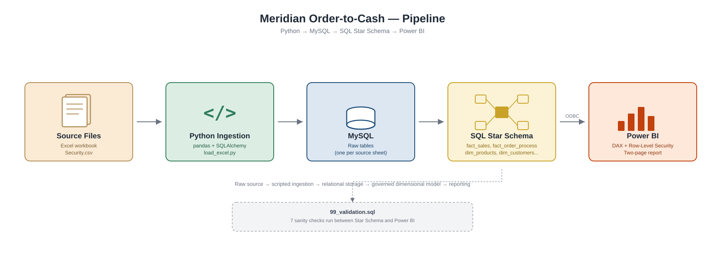
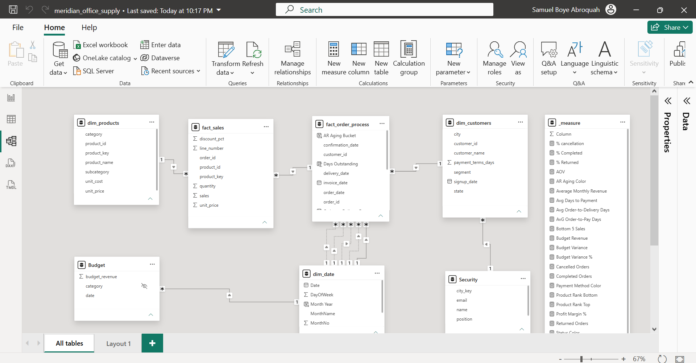
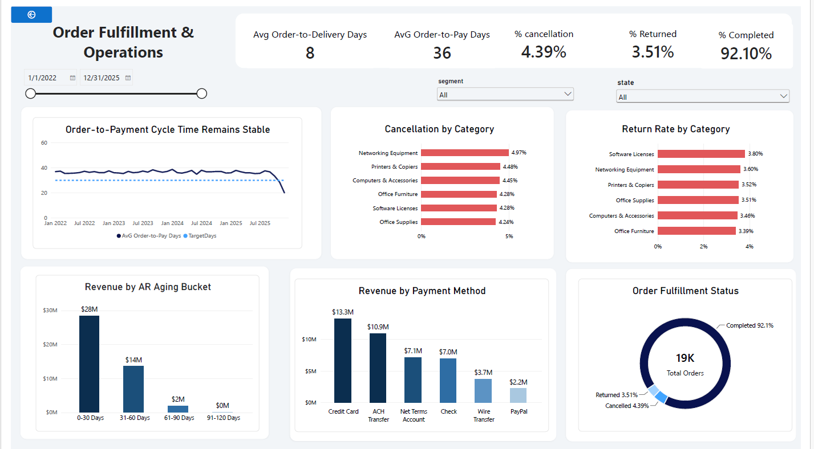

# Meridian Order-to-Cash Analytics Platform

An end-to-end analytics solution built for a simulated multi-year office & technology supply distributor. The project transforms raw operational data from Excel into a governed analytical model through automated ingestion, dimensional modeling, validation, and business intelligence reporting.

The solution demonstrates the complete analytics lifecycle:

**Excel → Python → MySQL → Star Schema → Power BI Semantic Model → Executive Dashboards**

---

## 📖 Project Overview

This project simulates a real-world Order-to-Cash (O2C) environment covering sales, fulfillment, invoicing, customer management, budgeting, and cash collection activities from 2022–2025.

The objective was to design and implement a scalable analytics platform capable of:

- Consolidating operational data from multiple business functions
- Building a governed dimensional model
- Supporting secure self-service analytics
- Tracking profitability and operational performance
- Enabling role-based data access through Row-Level Security (RLS)

The final solution delivers a reporting layer designed for both executive leadership and operational teams.

---

## 🏗️ Pipeline




---

## 📂 Repository Structure

```text
End-to-End-Order-to-Cash-Analytics-Platform/
│
├── Dataset/
│   ├── Meridian_OfficeSupply_OrderToCash_2022-2025.xlsx
│   └── Security.csv
│
├── python/
│   └── load_excel.py
│
├── sql/
│   ├── 01_fact_order_process.sql
│   ├── 02_fact_sales.sql
│   ├── 03_dim_products.sql
│   ├── 04_dim_customers.sql
│   ├── 05_dim_city.sql
│   ├── 06_dim_date.sql
│   └── 99_validation.sql
Load to power PI
├── Documents/
│   ├── Measure.dax data_model.png
│   ├── are-we-growing-profitably-dashboard.png
│   ├──  meridian_pipeline.png
│   └── order-fulfillment-and-operations-dashboard.png 
│
├── README.md
└── LICENSE
```

---

## 🛠 Data Engineering

### Data Ingestion

A custom Python ETL process loads all workbook sheets into MySQL and automates the creation of source tables.

### Technologies

- Python
- Pandas
- SQLAlchemy
- MySQL

### Ingestion Process

1. Read workbook sheets dynamically.
2. Create corresponding MySQL tables.
3. Load source data into raw tables.
4. Import Security.csv for Row-Level Security.
5. Validate load counts against source records.

This approach creates a repeatable ingestion framework and eliminates manual imports.

---

  ## ⭐ Dimensional Model



layer follows Kimball-style dimensional modeling principles.

### Fact Tables

#### fact_sales

**Grain:** One row per order line.

Captures:

- Revenue
- Quantity Sold
- Unit Price
- Customer Relationships
- Product Relationships

Used for:

- Sales reporting
- Revenue analysis
- Product performance analysis
- Profitability metrics

---

#### fact_order_process

**Grain:** One row per order.

An accumulating snapshot fact table tracking the complete order lifecycle:

- Order Date
- Confirmation Date
- Ship Date
- Delivery Date
- Invoice Date
- Payment Date
- Order Status

Used for:

- Fulfillment analysis
- SLA monitoring
- Order lifecycle tracking
- Collection cycle analysis

---

### Dimension Tables

#### dim_products

Contains:

- Product Name
- Category
- Subcategory
- Unit Cost
- Unit Price
- Product Year

Designed with yearly product records to support changing costs and prices over time.

---

### dim_customers

Customer dimension at a one-row-per-customer grain.

Features:

- Customer segmentation
- Standardized state abbreviations and full state names
- Geographic reporting attributes
- Payment term tracking
- Row-Level Security support via state mapping

The dimension exposes both state initials (e.g., KY) and full state names (e.g., Kentucky) to support reporting, mapping, and security filtering requirements.

---

#### dim_city

Contains:

- City
- State
- Geographic Reporting Structure

---

#### dim_date

A fully materialized calendar table covering 2022–2025.

Includes:

- Date
- Year
- Quarter
- Month
- Month Name
- Week Number
- Month Year

Built in SQL rather than using Power BI's `CALENDARAUTO()` function.

---

## ✅ Data Validation Framework

The project includes a dedicated validation layer.

### 99_validation.sql

Validation checks include:

- Source-to-target row counts
- Revenue reconciliation
- Duplicate record detection
- Null value checks
- Foreign key integrity checks
- Orphan record checks
- Order ID collision checks

Running these checks before connecting Power BI ensures reports are built on trusted and validated data.

---

## 🔐 Data Governance & Security

### Row-Level Security (RLS)

Dynamic Row-Level Security is implemented using the Security table imported from `Security.csv`.

Supported roles:

- General Manager
- State Supervisor

User access is filtered dynamically using the logged-in user's email address, ensuring each user only sees data for their assigned territory.

---

## 📊 Power BI Semantic Model

The semantic model sits between the SQL star schema and the reporting layer.

### Relationships

- One-to-many dimensional relationships
- Centralized fact tables
- Single-direction filter propagation
- Optimized analytical model

---

### DAX Measures

The model contains measures for:

#### Revenue & Orders

- Total Sales
- Total Sales All Orders
- Total Orders
- Completed Orders
- Cancelled Orders
- Returned Orders

#### Profitability

- Average Order Value (AOV)
- Total Cost
- Total Profit
- Profit Margin %
- Average Monthly Revenue

#### Fulfillment

- Avg Days to Payment
- Avg Order-to-Delivery Days
- Avg Order-to-Pay Days

#### AR Aging

- AR Aging Color
- AR Aging Bucket

#### Product Analytics

- Product Rank Top
- Product Rank Bottom
- Top 5 Sales
- Bottom 5 Sales

#### Budget Analysis

- Budget Revenue
- Budget Variance
- Budget Variance %

#### Conditional Formatting

- Status Color
- Payment Method Color

---

### Calculated Columns

#### fact_order_process

- Days Outstanding
- Order-to-Delivery Days
- Order-to-Pay Days
- AR Aging Bucket

#### dim_date

- Month Year

---

### DAX Documentation

Complete DAX definitions are documented in:

```text
Documents/Measure.dax
```

---

## 📈 Dashboard 1: Are We Growing Profitably?


### Business Questions Answered

- Is revenue growing over time?
- Is profitability improving?
- Which products generate the most profit?
- Which customers generate the most revenue?
- Are budget targets being achieved?

### Key KPIs

- Revenue
- Gross Profit
- Profit Margin %
- Budget Variance
- Average Order Value

---

## 🚚 Dashboard 2: Order Fulfillment & Operations



### Business Questions Answered

- Are orders being delivered on time?
- Which regions have fulfillment issues?
- How quickly are customers paying invoices?
- What is the AR aging profile?
- Are SLAs being met?

### Key KPIs

- Order Status
- Delivery Performance
- Collection Performance
- AR Aging Distribution
- Fulfillment Metrics

---

## 💡 Technical Highlights

- Automated Excel-to-MySQL ingestion
- Star schema dimensional modeling
- Accumulating snapshot fact table
- Dynamic Row-Level Security (RLS)
- DAX-based KPI framework
- Data validation and reconciliation checks
- ODBC integration
- Power BI semantic modeling
- Executive and operational reporting

---

## 🛠 Tools & Technologies

| Layer | Technology |
|---------|------------|
| Data Source | Excel |
| Security Source | CSV |
| ETL | Python, Pandas, SQLAlchemy |
| Database | MySQL 8 |
| Data Modeling | SQL Star Schema |
| Reporting | Power BI |
| Analytics | DAX |
| Connectivity | ODBC |
| Security | Dynamic RLS |
| Documentation | Markdown |

---

## 🚀 How to Run

### 1. Load Source Data

```bash
python load_excel.py
```

### 2. Build the Star Schema

Execute the SQL files in order:

```text
01_fact_order_process.sql
02_fact_sales.sql
03_dim_products.sql
04_dim_customers.sql
05_dim_city.sql
06_dim_date.sql
```

### 3. Validate the Data

```text
99_validation.sql
```

Ensure all validation checks pass before proceeding.

### 4. Connect Power BI

Connect to MySQL using ODBC and import:

```text
fact_sales
fact_order_process
dim_products
dim_customers
dim_city
dim_date
Security
```

### 5. Build the Semantic Model

- Create relationships
- Create DAX measures
- Configure Row-Level Security
- Build dashboards

---

## 👤 About

Built by **Samuel Boye Abroquah** — Quality Assurance Technician and Data Analytics Professional applying 12+ years of process-validation discipline to data engineering, business intelligence, and analytical system design.

- LinkedIn: https://linkedin.com/in/Samuel-Boye-Abroquah
- GitHub: https://github.com/Samuel-Boye-Abroquah

---

## 🎯 Skills Demonstrated

- Data Engineering
- Analytics Engineering
- SQL Development
- Dimensional Modeling
- ETL Development
- Power BI Development
- DAX
- Data Quality Management
- KPI Design
- Business Intelligence
- Data Governance
- Row-Level Security (RLS)
``
